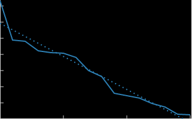
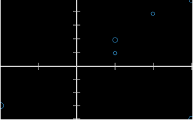

# guff: a plot device

guff reads a stream of points from a file / stdin and plots them.

guff is short for [MacGuffin][M].

[M]: https://en.wikipedia.org/wiki/MacGuffin

guff is distributed under the [ISC License][ISC].

[ISC]: https://opensource.org/licenses/isc-license.txt

## Plots them?

It can plot to stdout:

    $ wc -l *.c | grep -v total | sort -nr | awk '{print($1)}' | ./guff -d 72x30
        x: [0 - 15]    y: [0 - 302] -- 0: #
    +                                                                       
    #                                                                       
    |                                                                       
    |                                                                       
    |                                                                       
    +                                                                       
    |    #                                                                  
    |                                                                       
    |        #                                                              
    |                                                                       
    +             #                                                         
    |                  #                                                    
    |                      #                                                
    |                           #                                           
    |                                                                       
    +                                #                                      
    |                                                                       
    |                                    #                                  
    |                                                                       
    |                                                                       
    +                                                                       
    |                                                                       
    |                                         #    #                        
    |                                                  #                    
    |                                                       #               
    +                                                                       
    |                                                            #          
    |                                                                       
    |                                                                #    # 
    +----+----+----+----+----+----+----+----+----+----+----+----+----+----+-

    $ ./guff -d 40x20 -m count test_sin
        x: [0 - 720]    y: [-1 - 1]
    +                                       
    |                          ijjh         
    |                        9j1  2j8       
    |                       ba      ba      
    |                      98        98     
    +                     6a          b5    
    |                    1d            e    
    |                    e              e   
    |                   94              58  
    |                  2a                a2 
    6----+----+----+---d+----+----+----+--8-
    49                94                    
    |a3              49                     
    | e              e                      
    | 2c            d1                      
    +  78          96                       
    |   b6        7a                        
    |    d7      8c                         
    |     cg    hb                          
    |      3jjjj2                           

Or to SVG:

    $  wc -l *.c | grep -v total | sort -nr | awk '{print($1)}' | ./guff -s -m line -r > example.svg

    cat <<EOF | ./guff -s -x -m count
    1 1
    1 2
    -2 -3
    3 -4
    -2 -3
    2 4
    3 -4
    1 2
    3 5
    -2 -3

## Input format

guff reads a stream of lines of floating point numbers, separated by a single character:

    1 2.0 3

and

    1,2,3

both read as 1.0, 2.0, 3.0.

If multiple separators appear, then the value is treated as missing for that column's row:

    1,,3

reads as 1.0, [missing value], 3.0.

Any line beginning with "/" or "#" is ignored, and anything else that
`strtod(3)` considers an ill-formatted number (e.g. "-") will lead to
the rest of the line being skipped.

### Blank lines

Blank lines make guff plot and reset. For example, guff can be used to
convert an infinite stream of data periodically broken up by blank lines
into an infinite stream of SVG plots, also broken up by blank lines.
(The included script, `discretion`, splits these into timestamped SVG
files and updates a symlink to the newest.)

## Why write another plotter?

Not everything has graphic libraries installed (or a graphic environment at all),
and sometimes it's helpful to get a rough feel for data's distribution from a
text-mode command line. SVG images can also be generated pretty easily.

## Installation

guff depends on on nothing besides a standard POSIX environment.

To build it, type `make`.

To run the tests, type `make test`.

## Usage

    Usage: guff [-A] [-c] [-d WxH] [-f] [-h] [-l xyc]
                [-m MODE] [-r] [-s] [-S] [-x] [FILE]

Common options:

    -d WxH: set width and height (e.g. "-d 72x40", "-d 640x480")
    -f: flip x & y axes in plot
    -h: print help message
    -l LOG: any of 'x', 'y', 'c' -- set X, Y, and/or count to log scale
    -m MODE: dot, count, line (SVG only), default dot
    -s: render to SVG
    -x: treat first column as X for all following Y columns (def: use row count)

SVG only:

    -c: use colorblind-safe default colors
    -r: draw linear regression lines

Other options (mostly for internal testing):

    -A: don't draw axes
    -S: disable stream mode

For more details, see the man page.
